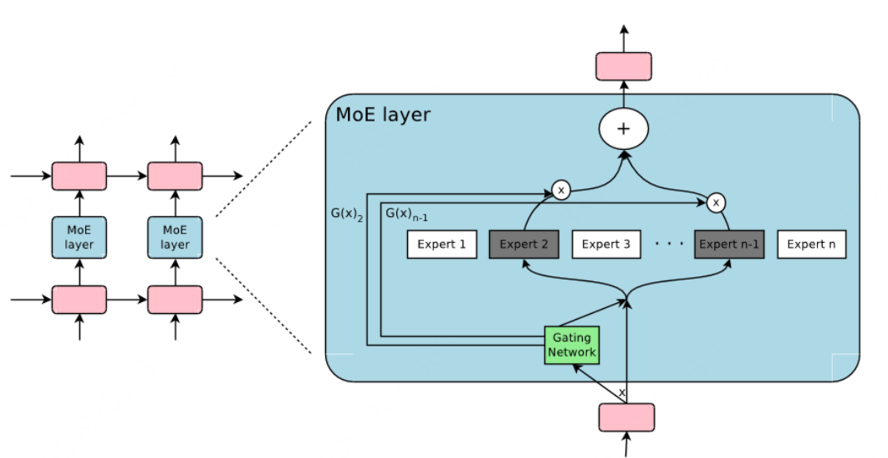
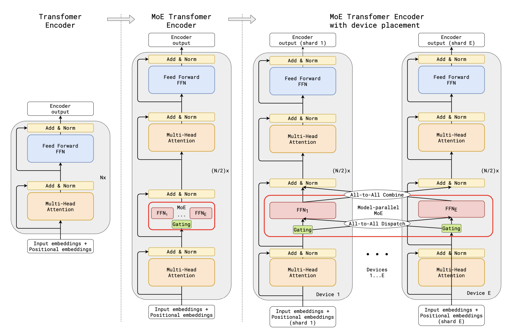
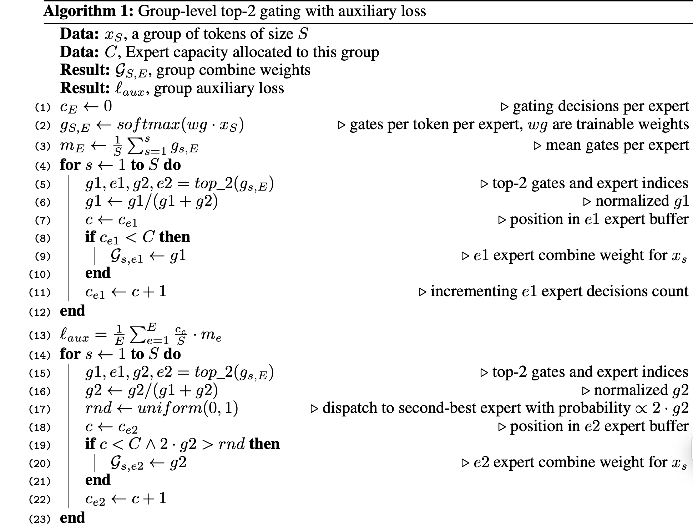
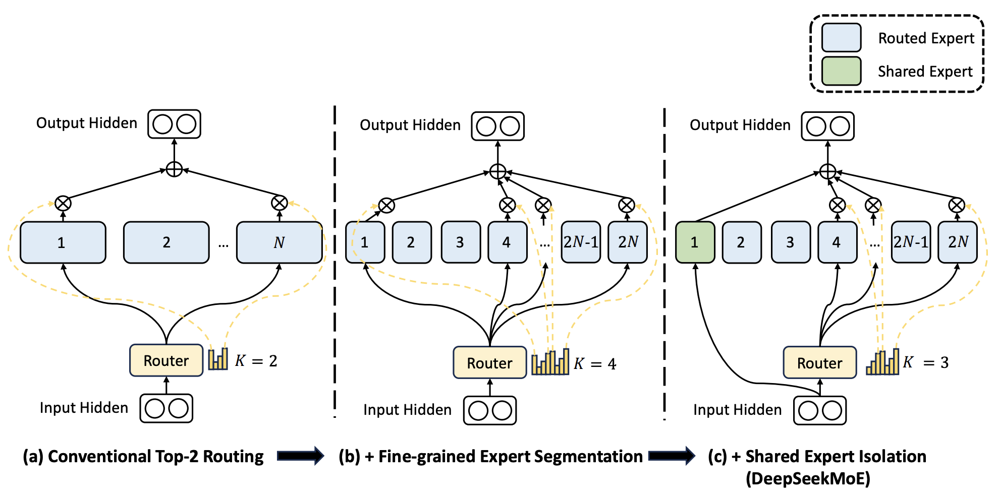
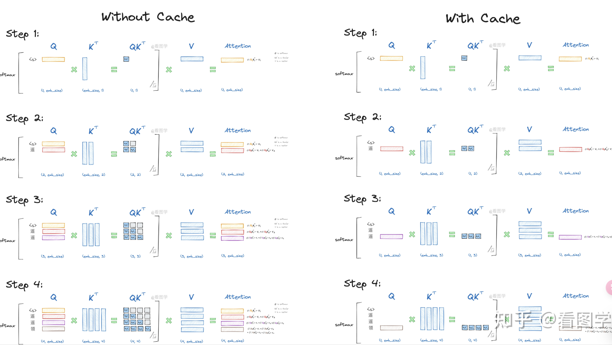
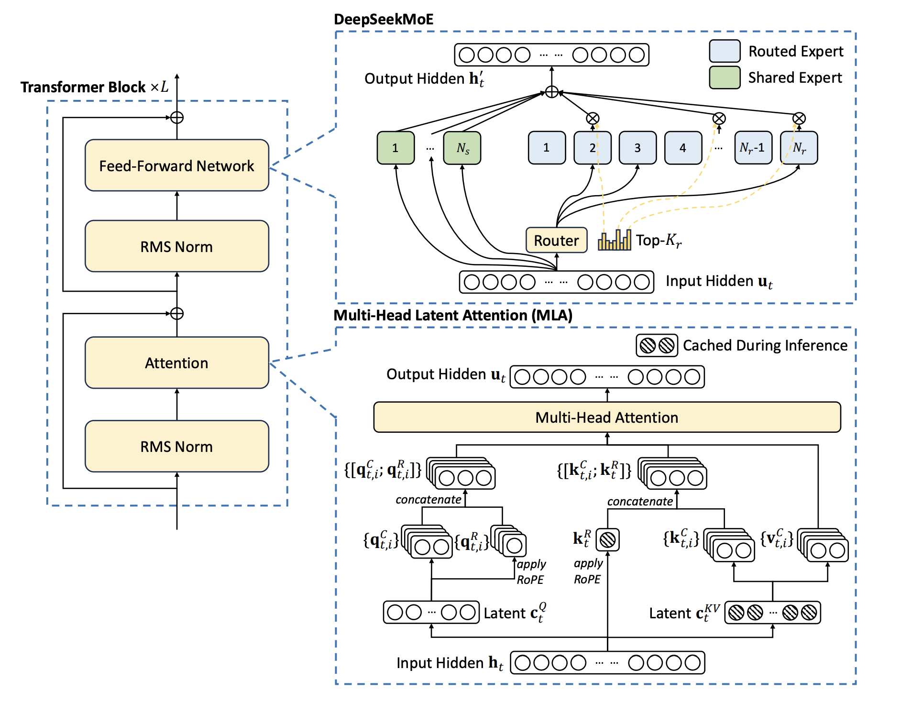
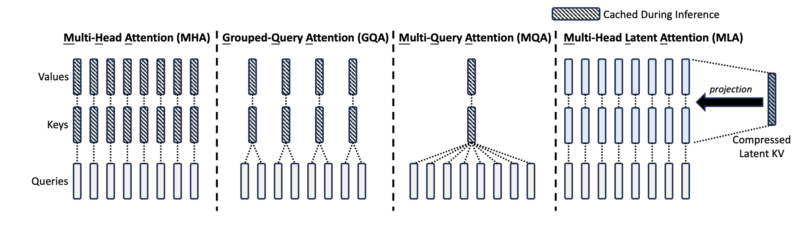
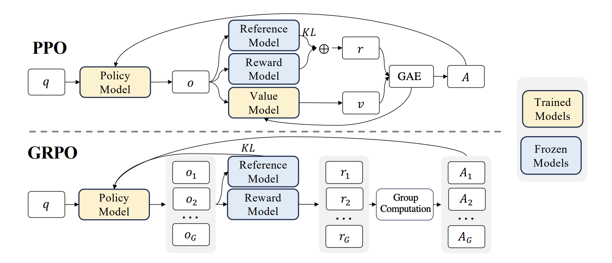
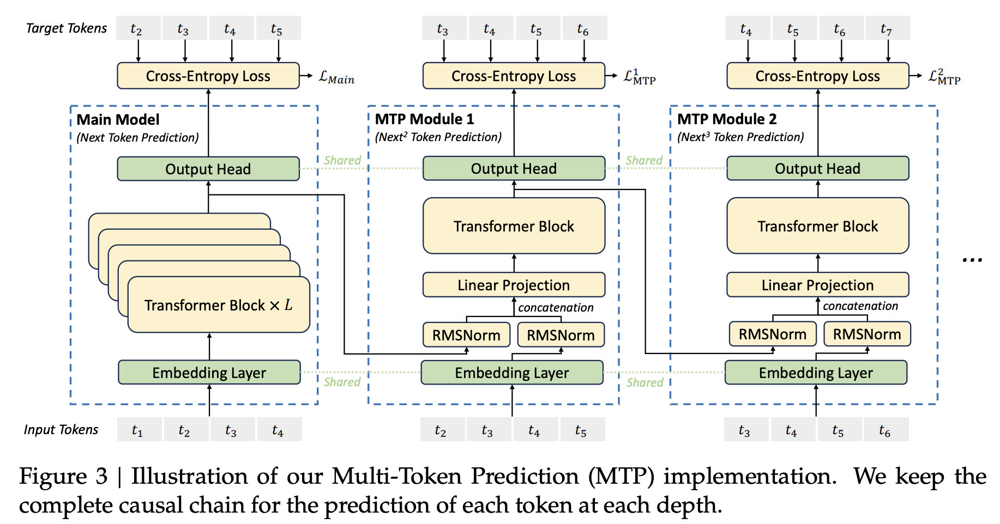
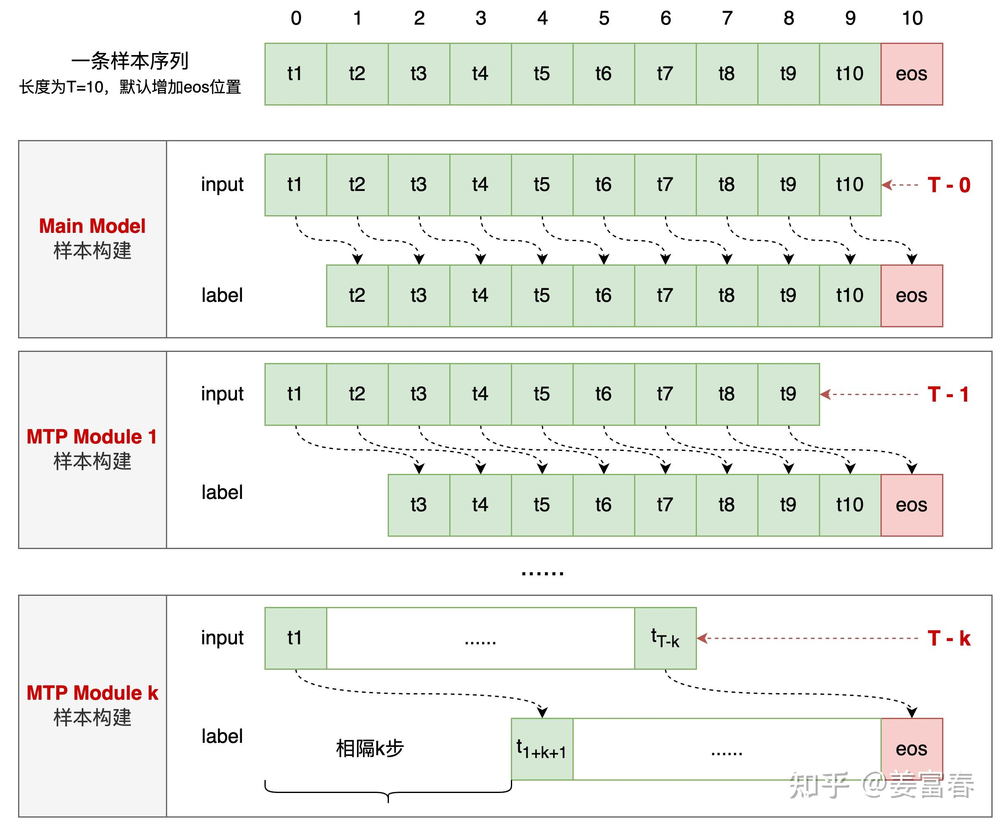

## DeepSeek Series Introduction

### 1. DeepSeek v1

论文链接：[https://arxiv.org/abs/2401.02954](https://arxiv.org/abs/2401.02954)

在这一时期 DS 并没有先专注于调整模型的具体结构，其主要工作在于：

- 首先研究了批量大小（batch size）和学习率（learning rate）的缩放规律（Scaling Law），并发现了它们随模型规模变化的趋势

- 在此基础上，对数据和模型规模的缩放规律进行了全面研究，成功揭示了最优的模型/数据规模扩展分配策略，并预测了大规模模型的预期性能
- 发现从不同数据集得出的缩放规律表现出显著差异，这表明数据集的选择对缩放行为有显著影响，这也意味着在跨数据集推广缩放规律时需要格外谨慎。

#### 预训练

**分词器**的实现采用 BBPE 算法，采用的预分词是为了阻止来自不同字符种类的 token 的合并；

**模型结构**方面大部分遵循了 LLaMA 的架构，包括 Pre-Norm，RMSNorm，SwiGLU for FFN，Rotary Embedding等，为优化推理成本，使用 GQA 代替了传统的 MHA。与大多数使用 GQA 的工作不同，作者通过增加网络深度而不是常规的增加中间层的宽度实现了更好的性能。

**学习率**调整上使用 multi-step 调度器替代 cosine 调度器，以保持性能并促进持续训练。

#### 对齐

SFT 和 DPO

---

在分析 DeepSeekMoE 前先简单回顾下两篇经典的 MoE 工作：

### Outrageously Large Neural Networks: The Sparsely-Gated Mixture-of-Experts Layer

论文链接：[https://arxiv.org/abs/1701.06538](https://arxiv.org/abs/1701.06538)

条件计算（conditional computation）通过在每个样本基础上激活网络的一部分，从而在不显著增加计算量的情况下大幅提升模型容量。作者实现条件计算的方法是引入一种新型的通用神经网络组件：**稀疏门控专家混合层**（Sparsely-Gated Mixture-of-Experts Layer, MoE）。MoE 由若干专家组成，每个专家是一个简单的前馈神经网络，同时包含一个可训练的门控网络，用于为每个输入选择专家的稀疏组合（见下图）。



MoE 层由一组 $n$ 个专家网络 $E_1,...E_n$ 和一个输出 $n$ 维稀疏向量的门控网络 $G$ 组成，专家网络本身是神经网络，虽然原则上只要求专家网络接受相同大小的输入并产生相同大小的输出，但是在该研究中作者将其设置为架构相同参数不同的前馈网络。

用 $G(x)$ 和 $E_i(x)$ 表示输入为 $x$ 时门控网络的输出以及第 $i$ 个专家的输出，则整个 MoE 模块的输出可以表示为：
$$
y = \sum_{i=1}^{n}G(x)_iE_i(x)
$$
其中 $G(x)$ 具有稀疏性，即类似于 $[0.6, 0.4, 0,...,0]$，因此实际的计算量并不大。

#### **门控网络**

1. **Softmax Gating**

一个简单的非稀疏门控：
$$
G(x) = \text{softmax}(x \cdot W_g)
$$

2. **Noisy Top-K Gating**

在先前的 Softmax 门控中添加两个组件，稀疏性和可调的高斯噪声：
$$
\text{softplus}(x) = \text{log}(1+e^x)
$$

$$
H(x)_i = (x \cdot W_g)_i + \text{StandardNormal()} \cdot \text{softplus}((x \cdot W_{noise})_i)
$$

$$
\text{KeepTopK}(v, k)_i = 
    \left\{
            \begin{aligned}
            &v_i && \text{if } v_i \text{ is in Top-K elements of } v \\
            &-\infty && \text{otherwise}
            \end{aligned}
    \right.
$$

$$
G(x) = \text{softmax} \left( \text{KeepTopK} \left(H(x), k \right) \right)
$$

#### 平衡专家使用

作者在实验中发现，门控网络倾向于收敛到一种状态：总是为少数几个专家分配大的权重，并且这种不平衡是自我强化的，因为受青睐的专家会训练得更快，因而也被门控网络更多选择。

为平衡专家的利用率，作者提出在损失函数中额外引入一个损失项 $L_{important}$，旨在鼓励所有专家的均衡使用，具体实现：

1. **专家重要性**

对于一个批次的训练样本 $X$，定义每个专家的重要性为：该专家在这批样本中被选择的权重的总和：
$$
\text{Importance}(X) = \sum_{x \in X}G(x)
$$

2. **变异系数**

变异系数是标准差与均值的比值，用于衡量数据的相对变异程度：
$$
\text{CV}(\text{Importance}(X)) = \frac{\text{Std}(\text{Importance}(X))}{\text{Mean}(\text{Importance}(X))}
$$

> 高 CV 值表示专家利用的不平衡性较大，低 CV 值表示专家利用较为均衡。

3. **额外损失项**

$$
L_{important}(X) = w_{important} \cdot \text{CV}(\text{Importance}(X))^2
$$

这篇文章的工作是在 RNN 中添加了 MoE 层，如上图所示，即每个 token 对应的位置（position）都会有一个 MoE 层，每个 MoE 层包含了一堆的专家（$Expert_{1, \cdots ,n} $），每个专家都是一个小型的 FFN，Gating Network 则会根据当前 position 的输入，选择少数几个专家来进行计算，也就是 ***token-level*** 的 MoE。

### GShard: Scaling Giant Models with Conditional Computation and Automatic Sharding

论文链接：[https://arxiv.org/abs/2006.16668](https://arxiv.org/abs/2006.16668)

这篇工作将 MoE 用在了 Transformer 架构中，具体方式是在编码器和解码器中，将每隔一个前馈层替换为带有 Top-2 门控变体的逐位置（position-wise）MoE 层。



#### Position-wise MoE

该模型中的 MoE 层正是基于前一篇介绍的工作，在稀疏门控与辅助损失上做出调整。Transformer 中的一个 MoE 层由 $E$ 个前馈网络组成：$FFN_1 \cdots FFN_E$：

$$
\mathcal{G}_{s, E} = \text{GATE}(x_s)
$$

$$
\text{FFN}_e(x_s) = wo_e \cdot \text{ReLU}(wi_e \cdot x_s)
$$

$$
y_s = \sum_{e=1}^{E}\mathcal{G}_{s,e} \cdot \text{FFN}_e(x_s)
$$

其中，$x_s$ 是 MoE 层的输入 token，$w_i$ 和 $w_o$ 分别是前馈层（一个专家）的输入与输出投影矩阵，$\mathcal{G}_{s,E}$ 是门控输出的稀疏向量，大部分为 0 表示 token 没有被分配给对应的专家，MoE 层的输出 $y_s$ 是对所有选定的专家输出的加权和（这里是设定为了 Top-2 专家）。

对于**门控函数**，对其的设计应该主要满足两个要求：1. 平衡负载；2. 大规模下的高效率。具体设计机制如下：

1. **Expert Capacity**

为确保负载平衡，我们需要强制要求一个专家处理的 token 数量低于某个统一阈值，并将其称为**专家容量**（Expert Capacity）。假设在一个训练批次中，总的 token 数为 $N$，每个 token 最多被分配给两个专家，则专家容量设置为 $O(\frac{N}{E})$。$\text{GATE}(\cdot)$ 会持续维护一个计数器 $c_e$ 以统计有多少 token 被分配到一个专家，如果一个 token 选择的两个专家都已经超过处理阈值，该 token 就被视为**溢出 token**，$\mathcal{G}_{s,E}$ 退化为零向量，然后这些 token（仍作为 $x_s$）将通过残差连接传递到下一层。

2. **Local Group Dispatching**

$\text{GATE}(\cdot)$ 将训练批次中的所有 token 分配到 $G$ 个组中，即每个组包含 $S = N / G$ 个 token，所有组可以独立并行地处理，这样每个组中每个专家被分配到的部分处理总量，就是 $\frac{2N}{G \cdot E}$，每个组确保最多只有这么多的标记被分发给一个专家，以确保专家容量得到控制，并且整体负载保持平衡。

3. **Auxiliary Loss and Random Routing**



根据图中算法，我们先看输入：

1. $x_S$，一组长度为 $S$ 的输入 token
2. $C$，分配给该组的专家容量

输出：

1. $\mathcal{G}_{S,E}$，该组的**门控权重**，形状为 $(S,E)$
2. $\ell_{aux}$，该组的**辅助损失**

然后我们分步理解该算法：

1. 初始化专家计数器并计算门控值

$$
c_E = 0
$$

$$
g_{S,E} = \text{softmax}(W_g \cdot x_S)
$$

$$
m_E= \frac{1}{S}\sum_{s=1}^{S}g_{s,E}
$$

初始化专家计数器；计算每个 token 对每个专家的门控值；计算每个专家的平均门控值

2. 处理最优专家

```python
for s = 1 in S:                        # 对每个在序列S中的token s
    g1, e1, g2, e2 = top_2(g_{s,E})    # 使用top_2函数获取两个最高门控值(g1,g2)及对应的专家索引(e1,e2)
    g1 = g1 / (g1 + g2)                # 归一化g1
    c = ce1
    if ce1 < C:                        # 如果e1专家未达到容量上限
        G_{s,e1} = g1                  # 将g1设为该token对e1专家的权重
    ce1 = c + 1
```

3. 处理次优专家

```python
for s = 1 in S:                        # 对每个在序列S中的token s
    g1, e1, g2, e2 = top_2(g_{s,E})    # 使用top_2函数获取两个最高门控值(g1,g2)及对应的专家索引(e1,e2)
    g2 = g2 / (g1 + g2)                # 归一化g2
    rnd = uniform(0, 1)                # 生成随机数rnd ∈ [0,1]
    c = ce2
    if ce2 < C and 2 * g2 > rnd:       # 对第二专家使用概率性分发（随机路由）
        G_{s,e2} = g2                  # 将g2设为该token对e2专家的权重
    ce2 = c + 1
```

4. 辅助损失

$$
\ell_{aux} = \frac{1}{E}\sum_{e=1}^{E}\frac{c_e}{S} \cdot m_e
$$

理想情况下，我们希望 $\frac{1}{E}\sum_{e=1}^{E}(\frac{c_e}{S})^2$ 最小（易得各 $\frac{c_{e_{i}}}{S}$ 相等时该式取最小（$\sum_{e=1}^{E}\frac{c_e}{S} = 1$），也就是平衡负载的情况，$c_e/S$ 表示专家 $e$ 的实际处理比例），但由于 $c_e$ 来自于离散操作，不可微；而 $m_e$ 表示专家 $e$ 的平均处理比例，也就是期望处理比例，并且由于其可微性，因而用其近似替代得到上述辅助损失公式。

### 总结对比

1. 门控机制的差异

Outrageously Large Neural Networks：
- 直接对所有 token 进行 Top-K 门控
- 使用 Noisy Top-K 门控增加随机性
- 机制简单，主要在于噪声添加与 Top-K 操作

GShard：
- 引入组级别 (Group-level) 处理
- 每组独立分配专家容量
- 对第二专家使用概率性选择 (2·g2 > rnd)
- 在容量限制与概率选择中确定 Top-1/2 专家

2. 辅助损失的差异

Outrageously Large Neural Networks：

- 定义专家重要性（一个专家在一个批次中被选择的总和），使用变异系数限制其平衡负载

GShard：

- 在各自组内通过最小化各专家的处理比例（一个专家在组内的处理次数与组内 token 数的比值）的均方值限制平衡负载

### 2. DeepSeekMoE

DS 首先提出现有 MoE 架构的潜在问题：

1. **知识混合**：现有 MoE 架构模型通常使用有限数量的专家（如 8 或者 16），因此分配给特定专家的 token 可能涵盖各种知识，因而指定专家的参数中也将收集大量不同类型的知识，这些知识很难同时利用。
2. **知识冗余**：分配给不同专家的 token 可能需要共享知识，导致各个专家各自的参数中同时学习了这些共享知识，从而导致专家参数的冗余。

针对上述问题，DS 引入了 DeepSeekMoE，其架构主要包括两个主要策略：

1. **细粒度专家分割**：保持参数数量不变，通过拆分 FFN 中间的隐藏维度将专家细分为更小的部分。相应地为保持恒定的计算成本，也需要激活更细粒度的专家以实现更灵活、适应性更强的激活专家组合。
2. **共享专家隔离**：将某些专家隔离起来始终激活，作为共享专家，将共享知识压缩其中，以减少其他专家的参数冗余，提高参数效率，使专家高度专业化

我们再根据 DS 的描述复述一下 MoE 的大致计算过程，首先是非 MoE 的计算：
$$
\begin{aligned}
\mathbf{u}_{1:T}^l &= \text{Self-Att}(\mathbf{h}_{1:T}^{l-1}) + \mathbf{h}_{1:T}^{l-1} \\ \\
\mathbf{h}_{t}^l &= \text{FFN}(\mathbf{u}_{t}^l) + \mathbf{u}_{t}^l
\end{aligned}
$$
$T$ 是序列长度，$\mathbf{u}_{1:T}^l$ 和 $\mathbf{h}_{t}^l$ 分别表示序列的所有 token 在第 $l$ 个注意力层后的隐藏状态和第 $t$ 个token 在第 $l$ 个 Transformer 块后的隐藏状态。

将部分 FFN 替换为 MoE 后：
$$
\begin{aligned}
h_t^l &= \sum_{i=1}^N \left(g_{i,t}\text{FFN}_i \left(\mathbf{u}_t^l \right) \right) + \mathbf{u}_{t}^l \\ \\
g_{i,t} &= 
  \left\{
    \begin{aligned}
      & s_{i,t} && s_{i,t} \in \text{Top-K}(\{ s_{j,t} | 1 \leq j \leq N \},K) \\
      & 0 && \text{otherwise}
    \end{aligned}
  \right.
\\ \\ 
s_{i,t} &= \text{Softmax}_i(\mathbf{u}_t^{l^T} \mathbf{e}_i^l)
\end{aligned}
$$
其意思与之前介绍的 MoE 部分类似，只是具体公式表述差异，真正的差异往往就是在门控计算 $g_{i,t}$ 和 $\text{Top-K}$ 的选择上

#### DeepSeekMoE 的架构



从左到右分别描述了：普通的 Top-2 MoE → **细粒度** MoE → 添加**共享专家**的细粒度 MoE（DeepSeekMoE），但是注意，在上述三个情景中并没有增加参数和计算成本。

**细粒度 MoE**，具体来说，在典型的 MoE 架构基础上，将每个专家再细分为 $m$ 个专家，相应地，将 FFN 中间的隐藏维度降低到原来的 $\frac{1}{m}$，由于每个专家都变小了，为了保持相同的计算成本，我们也相应地激活相比原来 $m$ 倍的专家，即原 $\text{Top-K}$ 会变为 $\text{Top-mK}$

**共享专家隔离**，隔离 $K_s$ 个专家作为共享，无论门控如何选择，token 总是会被传给这些专家，为保持计算成本不变，激活专家数量会变为 $mK - K_s$

##### 平衡负载

对于 MoE 架构来说，最需要关注的除了门控机制外，就是平衡负载的额外损失的设计问题：

**专家级平衡损失**（Expert-Level Balance Loss）
$$
\begin{aligned}
\mathcal{L}_{\text{ExpBal}} &= \alpha_1 \sum_{i=1}^{N'} f_i P_i, \\

f_i &= \frac{N'}{K'T} \sum_{t=1}^T \mathbb{I}(\text{Token } t \text{ selects Expert } i), \\

P_i &= \frac{1}{T} \sum_{t=1}^T s_{i,t},
\end{aligned}
$$
$\alpha_1$ 是一个超参数，称为专家级平衡因子，简洁起见，$N' = mN - K_s$（即由门控可选择的专家个数），$K' = mK - K_s$（实际激活的专家个数），$\mathbb{I}(\cdot)$ 表示指示函数，当 token $t$ 选择专家 $i$ 时为 1，否则为 0

$P_i$ 是专家 $i$ 在所有 token 上的平均得分；$f_i$ 是专家 $i$ 的使用频率，$\frac{N'}{K'T}$ 是一个归一化因子，理想情况下每个专家应该处理 $\frac{K'T}{N'}$ 个 token，所以当 $f_i = \frac{N'}{K'T} \cdot \frac{K'T}{N'} = 1$ 时表示该专家的使用频率是平均水平，大于 1 表示过度使用，反之表示使用不足。

**设备级平衡损失**

当目标是缓解计算瓶颈时，在专家级别强制执行严格的平衡约束变得不必要，因为对负载平衡的过度约束会损害模型性能。相反，我们的主要目标是确保设备之间的计算负载均衡。如果我们将所有路由专家分成D组 $\{ \mathcal{E}_1,...,\mathcal{E}_D \}$，并将每组部署在单个设备上，设备级平衡损失的计算如下：
$$
\begin{aligned}
\mathcal{L}_{\text{DevBal}} &= \alpha_2 \sum_{i=1}^D f_i' P_i', \\

f_i' &= \frac{1}{|\mathcal{E}_i|} \sum_{j \in \mathcal{E}_i} f_j,  \\

P_i' &= \sum_{j \in \mathcal{E}_i} P_j, \\
\end{aligned}
$$

### 3. DeepSeek V2

DeepSeek V2 在 Transformer 架构中的注意力模块与 FFN 上进行了优化，具体来说就是：

**多头潜在注意力**（Multi-Head Latent Attention, MLA）和 **DeepSeekMoE**

(1) MHA 中的 KV Cache 对 LLM 的推理效率构成了严重阻碍，因而也有诸如 GQA，MQA 等的改进，但是这些方法通常会在减少 KV Cache 时造成性能损失，为兼顾二者，V2 中引入了 **MLA**

(2) DeepSeekMoE 主要引入了细粒度专家与共享专家隔离

#### KV Cache

简单介绍一下 KV Cache，其用于推理阶段，是一种以空间换时间的推理加速手段，回顾一下注意力计算的公式：
$$
\texttt{attention} = \texttt{softmax} (\frac{QK^T}{\sqrt{d_k}}) V
$$
由于模型的 **自回归** 性质，模型先前的输出也会作为下一步预测时的输入，模型在不断预测并输出的过程中，其相邻两次接受的输入其实只相差一个最新预测的 token，比如：

```
step 0 input: I'm learning natural
step 1 input: I'm learning natural language
step 2 input: I'm learning natural language processing
step 3 input: I'm learning natural language processing and
......
```

所以其实输入的重复部分会越来越多，接着我们回想 $Q, K, V$ 是如何产生的（令 $X=[x_1,...x_n]$ 为输入序列）：
$$
Q = XW_Q \\
K = XW_K \\
V = XW_V
$$
按照我们上面关于输入里有很多重复的讨论，那我们可以这么来表示（以 $K$ 为例）：
$$
K = \texttt{concat} (X_{previous},~ X_{last})W_K
$$
可以看到，对于 $X_{previous}$ 的计算占了大部分，并且还都是重复的，所以一个很自然的想法就是把之前算的 $K$ 缓存起来，每次只计算当前词的 $K$，然后将其与之前缓存的 $K$ 拼接起来，得到的结果与上述经过重复计算的 $K$ 是一样的，并且还减少了大量的冗余计算，提高了计算效率，所以 KV Cache 解决的**计算瓶颈**是在于：

> 在输入序列 $X$ 经线性变换（也就是 $W_k$ 等矩阵）得到 $QKV$ 矩阵的过程中，减少了大量对于重复的输入部分进行线性变换的计算量。

- 无 KV cache 时：

每生成一个新词，都需要重新计算所有 $K$ 和 $V$，计算复杂度为 $O(n^2)$

- 使用 KV cache 时：

每生成一个新词，仅需计算最后一个生成的词的 $K_{last}$ 和 $V_{last}$，并将其与缓存拼接，计算复杂度降为 $O(n)$

**Q1**：**如何实现 KV Cache ** ？

在输入 $X$ ，生成第一个 token $t_1$ 后，就缓存下第一块 $K_{cache}$ 和 $V_{cache}$；当生成第二个词时，只需要对最新生成的 token $t_1$ 计算其 $KV$ 
$$
K_{last} = t_1W_K \\
V_{last} = t_1W_V
$$
再将前面缓存的 $KV$ 进行拼接：
$$
K_{new} = \texttt{concat} (K_{cache},~ K_{last}) \\
V_{new} = \texttt{concat} (V_{cache},~ V_{last})
$$
就得到了对输入序列 $X$ 与新词 $t_1$ 相关的 $KV$，然后更新其为新的缓存，作为下一步计算用到的缓存。

**Q2**：**为什么不需要 Q Cache** ？

在生成第 $t$ 个 token 的时候：
$$
Q_t = x_tW_Q
$$
即只需要考虑当前 token 生成的 $Q_t$ 向量并进行后续注意力计算，并不需要缓存前面的 $Q_{1...t-1}$，因为使用这些 $Q$ 向量与 $K^T$ 相乘得到的结果跟之前计算得到的结果是一样的，不需要这些重复的结果，所以每次对新的 token 产生的 $Q$ 向量都是不同的，因此不需要缓存，贴一张很清晰的图（图源：[https://zhuanlan.zhihu.com/p/662498827](https://zhuanlan.zhihu.com/p/662498827)）：



因为在自注意力中，最初输入的序列对于 $W_q,W_k,W_v$ 来说都是一样的，所以不设置缓存时，每次计算的输入就是在重复上一次的输入之后加了一个新的 token 而已，由此就导致了大量的计算冗余；而设置缓存后，每次的输入只取最后一个 token（就是前面最新生成的），因此对于 Q 来说就是只需要考虑当前 token 生成的 $Q_t$ 向量，对于 KV 来说也是只考虑当前 token 生成的 KV 向量（之前的直接拼接缓存就好了）

#### 模型架构



DeepSeek V2 的整体架构如上图，接下来我们主要看 MLA 的部分，首先简单回顾标准的多头注意力：

#### MHA

对于第 $t$ 个输入 token $\mathbf{h}_t \in \mathbb{R}^d$：
$$
\mathbf{q}_t = W^Q\mathbf{h}_t \\
\mathbf{k}_t = W^K\mathbf{h}_t \\
\mathbf{v}_t = W^V\mathbf{h}_t
$$
拆分为多头：
$$
[\mathbf{q}_{t,1};\mathbf{q}_{t,2};\cdots;\mathbf{q}_{t,n_h}] = \mathbf{q}_t \\
[\mathbf{k}_{t,1};\mathbf{k}_{t,2};\cdots;\mathbf{k}_{t,n_h}] = \mathbf{k}_t \\
[\mathbf{v}_{t,1};\mathbf{v}_{t,2};\cdots;\mathbf{v}_{t,n_h}] = \mathbf{v}_t 
$$

$$
\begin{aligned}
\mathbf{o}_{t,i} &= \sum_{j=1}^{t}\text{Softmax}_j(\frac{\mathbf{q}_{t,i}^T\mathbf{k}_{j,i}}{\sqrt{d_h}})\mathbf{v}_{j,i} \\ \\
\mathbf{u}_t &= W^O[\mathbf{o}_{t,1},\cdots,\mathbf{o}_{t,n_h}]
\end{aligned}
$$

所以对于 MHA，需要对每个 token 缓存 $2n_hd_hl$ 个元素（$l$ 是层数），这个庞大的缓存需求是限制最大 Batch Size 和 Sequence Length 的巨大瓶颈。

#### MLA

MLA 的核心是对 Keys 和 Values 进行低秩联合压缩（Low-rank joint compression）以减少 KV Cache：
$$
\begin{aligned}
\mathbf{c}_t^{KV} &= W^{DKV}\mathbf{h}_t \\ \\
\mathbf{k}_t^C &= W^{UK}\mathbf{c}_t^{KV} \\ \\
\mathbf{v}_t^C &= W^{UV}\mathbf{c}_t^{KV}
\end{aligned}
$$
$\mathbf{c}_t^{KV} \in \mathbb{R}^{d_c}$ 是 Keys 和 Values 的压缩潜在向量，$d_c$ 是压缩潜在向量的维度，$d_c \ll d_hn_h$；$W^{DKV} \in \mathbb{R}^{d_c \times d}$ 是对输入 token $\mathbf{h}_t \in \mathbb{R}^d$ 的下投影矩阵，相应地 $W^{UK},W^{UV}$ 是用于恢复 KV 的上投影矩阵。

因此在推理时，对于每个 token，MLA 只需要缓存 $c_t^{KV}$，也就是 $d_cl$ 个元素；此外，由于在推理过程中，$W^{UK}$ 可以被吸收到 $W^Q$ 中，$W^{UV}$ 可以被吸收到 $W^O$ 中，我们甚至不需要为注意力机制计算键和值。

> ---
>
> ##### **1. 键（Key）投影的参数吸收**
> **原始计算流程**：
> 1. 输入 token $\mathbf{h}_t$ 通过下投影生成压缩潜在向量：
>    $$
>    \mathbf{c}_t^{KV} = W^{DKV} \mathbf{h}_t \quad \in \mathbb{R}^{d_c}
>    $$
> 2. 生成第 $i$ 个头的键向量：
>    $$
>    \mathbf{k}_{t,i}^C = W^{UK}_i \mathbf{c}_t^{KV} \quad \in \mathbb{R}^{d_h}
>    $$
>    其中 $W^{UK}_i \in \mathbb{R}^{d_h \times d_c}$ 是键的上投影矩阵。
>
> 3. 注意力计算时，查询 $\mathbf{q}_{t,i} = W^Q_i \mathbf{h}_t$ 与历史键 $\mathbf{k}_{j,i}^C$ 的点积为：
>    $$
>    \mathbf{q}_{t,i}^\top \mathbf{k}_{j,i}^C = \mathbf{h}_t^\top (W^Q_i)^\top W^{UK}_i \mathbf{c}_j^{KV}
>    $$
>
> **参数吸收机制**：
> - 将 $W^{UK}_i$ 合并到 $W^Q_i$ 中，定义新的查询投影矩阵：
>   $$
>   W^{Q'}_i = (W^{UK}_i)^\top W^Q_i \quad \in \mathbb{R}^{d_c \times d}
>   $$
> - 新的查询向量为：
>   $$
>   \mathbf{q}'_{t,i} = W^{Q'}_i \mathbf{h}_t \quad \in \mathbb{R}^{d_c}
>   $$
> - 注意力点积简化为：
>   $$
>   \mathbf{q}'_{t,i} \cdot \mathbf{c}_j^{KV} = \mathbf{h}_t^\top (W^{Q'}_i)^\top \mathbf{c}_j^{KV}
>   $$
>   这与原始点积等价，但无需显式计算 $\mathbf{k}_{j,i}^C$。
>
> **效果**：  
> - 键的上投影 $W^{UK}_i$ 被吸收到查询矩阵 $W^{Q'}_i$ 中，推理时仅需缓存 $\mathbf{c}_j^{KV}$，无需存储或计算 $\mathbf{k}_{j,i}^C$。
>
> ---
>
> ##### **2. 值（Value）投影的参数吸收**
> **原始计算流程**：
> 1. 生成第 $i$ 个头的值向量：
>    $$
>    \mathbf{v}_{t,i}^C = W^{UV}_i \mathbf{c}_t^{KV} \quad \in \mathbb{R}^{d_h}
>    $$
>    其中 $W^{UV}_i \in \mathbb{R}^{d_h \times d_c}$ 是值的上投影矩阵。
>
> 2. 注意力输出为：
>    $$
>    \mathbf{o}_{t,i} = \sum_j \alpha_{ij} \mathbf{v}_{j,i}^C = W^{UV}_i \sum_j \alpha_{ij} \mathbf{c}_j^{KV}
>    $$
>
> **参数吸收机制**：
> - 将 $W^{UV}_i$ 合并到输出投影矩阵 $W^O$ 中。假设原始输出投影为：
>   $$
>   \mathbf{u}_t = W^O [\mathbf{o}_{t,1}; \cdots; \mathbf{o}_{t,n_h}] \quad \in \mathbb{R}^d
>   $$
> - 合并后的输出投影矩阵为块对角矩阵与 $W^O$ 的乘积：
>   $$
>   W^{O'} = W^O \cdot \text{blkdiag}(W^{UV}_1, \dots, W^{UV}_{n_h}) \quad \in \mathbb{R}^{d \times n_h d_c}
>   $$
> - 最终输出简化为：
>   $$
>   \mathbf{u}_t = W^{O'} \left[ \sum_j \alpha_{1j} \mathbf{c}_j^{KV}; \cdots; \sum_j \alpha_{n_h j} \mathbf{c}_j^{KV} \right]
>   $$
>
> **效果**：  
> - 值的上投影 $W^{UV}_i$ 被吸收到输出矩阵 $W^{O'}$ 中，推理时只需对 $\mathbf{c}_j^{KV}$ 加权求和，无需存储或计算 $\mathbf{v}_{j,i}^C$。
>




此外，为了减少训练过程中的激活内存，这里还进行了对 Queries 的低秩压缩（无法减少 KV Cache）：
$$
\mathbf{c}_t^Q = W^{DQ}\mathbf{h}_t \\
\mathbf{q}_t^C = W^{UQ}\mathbf{c}_t
$$

#### Decoupled RoPE

待更新

#### 对齐

1. 监督微调

2. 强化学习

**GRPO**

### 3.5 GRPO（From DeepSeekMath）

论文链接：[https://arxiv.org/abs/2402.03300](https://arxiv.org/abs/2402.03300)

这篇工作的主要贡献在于在**数学领域的可扩展预训练**，以及对**强化学习的探索与分析**，其中作者也提出了一些 insights：

1. **Math Pre-Training at Scale**

- 参数数量并不是数学推理能力的唯一关键因素，一个在高质量数据上预训练的小模型也可以实现比肩大模型的强大性能
- Code Training 能够提高推理能力，至少对于数学推理来说（DeepSeekMath 是在 DeepSeek Coder 上继续预训练的）

2. **Exploration and Analysis of Reinforcement Learning**

- 引入了群组相对策略优化（**GRPO**），放弃了 critic model（价值函数），而是从群体分数估计基线（baseline），相比于 PPO 大幅减少了训练资源
- 仅使用指令调优数据，GRPO 显著提高了指令微调模型 DeepSeekMath-Instruct 的性能
- 提供了一个统一的范式来理解不同的方法，如 RFT、DPO、PPO 和 GRPO

#### From PPO to GRPO

PPO 是一种广泛用于 LLM 强化微调的 actor-critic RL 算法，它通过最大化以下代理目标来优化 LLM：
$$
\mathcal{J}_{\text{PPO}}(\theta) = \mathbb{E} \left[{q \sim P(Q), o \sim \pi_{\theta_{\text{old}}}(O|q)} \right]\frac{1}{|o|}\sum_{t=1}^{|o|} \min\left[\frac{\pi_\theta(o_t|q,o_{<t})}{\pi_{\theta_{\text{old}}}(o_t|q,o_{<t})}A_t, \text{clip}\left(\frac{\pi_\theta(o_t|q,o_{<t})}{\pi_{\theta_{\text{old}}}(o_t|q,o_{<t})}, 1-\epsilon, 1+\epsilon\right)A_t\right]
$$
其中 $\pi_\theta$ 和 $\pi_{\theta_{old}}$ 分别是当前和旧的策略模型，$q$ 和 $o$ 分别是从问题数据集和旧策略 $\pi_{\theta_{old}}$ 中采样的问题和输出。$\epsilon$ 是 PPO 中引入的一个与裁剪相关的超参数，用于稳定训练过程。$A_t$ 是优势函数，它通过广义优势估计（GAE）计算得出，它的计算基于**奖励序列** ${r_{\geq t}}$ 和一个已学习的**价值函数** $V_\psi$。

因此，在 PPO 中，需要同时训练一个价值函数和策略模型。为了缓解对奖励模型的过度优化，标准方法是在每个 token 的奖励中添加一个来自参考模型的 per-token KL 惩罚项：
$$
r_t = r_{\varphi}({q,o_{\leq t}}) - \beta\log\frac{\pi_{\theta}(o_t|q,o_{<t})}{\pi_{ref}(o_t|q,o_{<t})}
$$
其中 $r_{\varphi}$ 是奖励模型，$\pi_{ref}$ 是参考模型，一般是初始的 SFT 模型。

---

PPO 中使用的价值函数通常是另一个与策略模型相当规模的模型，这带来了大量的内存和计算负担。此外，在 RL 训练过程中，**价值函数被用作计算优势函数时的基线**，用于减少方差。而在 LLM 环境中，通常只有最后一个 token 会被奖励模型赋予奖励分数，这可能会使得训练一个在每个 token 位置都准确的价值函数变得复杂。



为了解决这个问题，如图所示，作者提出了群组相对策略优化（Group Relative Policy Optimization, GRPO），它**避免了像 PPO 那样需要额外的价值函数近似**，而是使用对**同一问题的多个采样输出的平均奖励作为基线**。具体来说，对于每个问题 $q$，GRPO 从旧策略 $\pi_{\theta_{old}}$ 中采样一组输出 $\{o_1, o_2, \cdots, o_G\}$，然后通过最大化以下目标函数来优化策略模型：

$$
\begin{aligned}
\mathcal{J}_{\text{GRPO}}(\theta) &= \mathbb{E}[q \sim P(Q), \{o_i\}_{i=1}^G \sim \pi_{\theta_{\text{old}}}(O|q)] \\ 
& \frac{1}{G} \sum_{i=1}^G \frac{1}{|o_i|} \sum_{t=1}^{|o_i|} \left\{\min \left[\frac{\pi_\theta(o_{i,t}|q,o_{i,<t})}{\pi_{\theta_{\text{old}}}(o_{i,t}|q,o_{i,<t})} \hat{A}_{i,t}, \text{clip}\left(\frac{\pi_\theta(o_{i,t}|q,o_{i,<t})}{\pi_{\theta_{\text{old}}}(o_{i,t}|q,o_{i,<t})}, 1-\epsilon, 1+\epsilon\right)\hat{A}_{i,t}\right] - \beta\mathbb{D}_{\text{KL}}[\pi_\theta||\pi_{\text{ref}}]\right\}
\end{aligned}
$$
$\hat{A}_{i,t}$ 是基于每个组内输出的相对奖励计算出的优势（Advantage）。GRPO 利用的组相对方式来计算优势，很好地与奖励模型的比较性质相吻合，因为奖励模型通常是在相同问题上输出的对比数据集上进行训练。GRPO 直接将训练策略与参考策略之间的 KL 散度添加到损失中来规范策略，而不是在奖励中添加 KL 惩罚，从而避免了计算 $\hat{A}_{i,t}$ 的复杂性。

形式上，对于每个问题 $q$，从旧策略模型 $\pi_{\theta_{old}}$ 中采样一组输出 $\{o_1,o_2,\cdots,o_G\}$。然后使用奖励模型对这些输出进行评分，相应地得到 $G$ 个奖励 $\mathbf{r}=\{r_1,r_2,\cdots,r_G\}$。随后，通过减去组平均值并除以组标准差来对这些奖励进行标准化。结果监督提供了每个输出 $o_i$ 末尾的标准化奖励，并将输出中所有 token 的优势 $\hat{A}_{i,t}$ 设置为标准化奖励，即 $\hat{A}_{i,t}=\tilde{r}_i=\frac{r_i-\text{mean}(\mathbf{r})}{\text{std}(\mathbf{r})}$
$$
\begin{aligned}
& \textbf{算法 1: 迭代群组相对策略优化} \\
& \textbf{输入:} \text{初始策略模型 } \pi_{\theta_{\text{init}}} \text{；奖励模型 } r_\varphi \text{；任务提示集 } \mathcal{D} \text{；超参数 } \epsilon, \beta, \mu \\
& \text{1: 策略模型 } \pi_\theta \leftarrow \pi_{\theta_{\text{init}}} \\
& \text{2: } \textbf{for } \text{iteration} = 1,\ldots,I \textbf{ do} \\
& \text{3: } \quad \text{参考模型 } \pi_{\text{ref}} \leftarrow \pi_\theta \\
& \text{4: } \quad \textbf{for } \text{step} = 1,\ldots,M \textbf{ do} \\
& \text{5: } \quad\quad \text{从 } \mathcal{D} \text{ 中采样一个批次 } \mathcal{D}_b \\
& \text{6: } \quad\quad \text{更新旧策略模型 } \pi_{\theta_{\text{old}}} \leftarrow \pi_\theta \\
& \text{7: } \quad\quad \text{对每个问题 } q \in \mathcal{D}_b \text{ 采样 G 个输出 } \{o_i\}_{i=1}^G \sim \pi_{\theta_{\text{old}}}(\cdot | q) \\
& \text{8: } \quad\quad \text{通过运行 } r_\varphi \text{ 计算每个采样输出 } o_i \text{ 的奖励 } \{r_i\}_{i=1}^G \\
& \text{9: } \quad\quad \text{通过群组相对优势估计计算 } o_i \text{ 的第 t 个token的 } \hat{A}_{i,t} \\
& \text{10: } \quad\quad \textbf{for } \text{GRPO iteration} = 1,\ldots,\mu \textbf{ do} \\
& \text{11: } \quad\quad\quad \text{通过最大化 GRPO 目标（公式见下）更新策略模型 } \pi_\theta \\
& \text{12: } \quad \text{使用重放机制通过持续训练更新 } r_\varphi \\
& \textbf{输出:} \pi_\theta
\end{aligned}
$$
**梯度系数公式**：
$$
GC_{GRPO}(q,o,t,\pi_{\theta_{rm}}) = \hat{A}_{i,t} + \beta \left(\frac{\pi_{ref}(o_{i,t}|o_{i,<t})}{\pi_\theta(o_{i,t}|o_{i,<t})} - 1\right)
$$

这里添加了迭代策略，在迭代中也持续更新奖励模型以更好地训练策略模型。

### 4. DeepSeek V3

DS V3 在架构方面仍然采用了 DeepSeekMoE 以及 MLA，并实施了额外的两个策略以进一步增强模型性能：

1. 辅助无损策略（Auxiliary-loss-free），用于负载均衡，旨在尽量减少为鼓励负载平衡而对模型性能产生的负面影响
2. 多 token 预测训练目标（Multi-token prediction，MTP）

**DSMoE in V3**：
$$
h'_t = \mathbf{u}_t + \sum_{i=1}^{N_s} \text{FFN}_i^{(s)}(\mathbf{u}_t) + \sum_{i=1}^{N_r} g_{i,t}\text{FFN}_i^{(r)}(\mathbf{u}_t)
$$

$$
g_{i,t} = \frac{g'_{i,t}}{\sum_{j=1}^{N_r} g'_{j,t}}
$$

$$
g'_{i,t} = \begin{cases}
s_{i,t}, & \text{if } s_{i,t} \in \text{Topk}(\{s_{j,t}|1 \leq j \leq N_r\}, K_r) \\
0, & \text{otherwise}
\end{cases}
$$

$$
s_{i,t} = \text{Sigmoid}(\mathbf{u}_t^T\mathbf{e}_i)
$$

不同于 V2（$\text{Softmax}$），在 V3 中专家分数 $s_{i,t}$ 使用 $\text{Sigmoid}$ 计算，并对 $g_{i,t}$ 进行归一化。

#### Auxiliary-Loss-Free Load Balancing

$$
g'_{i,t} = \begin{cases}
s_{i,t}, & \text{if } s_{i,t} + b_{i} \in \text{Topk}(\{s_{j,t} + b_{j}|1 \leq j \leq N_r\}, K_r) \\
0, & \text{otherwise}
\end{cases}
$$

在路由时，为每个专家添加一个偏置项 $b_i$，将其加入 $s_{i,t}$ 中以计算 $\text{Top-K}$ 路由。但注意其**仅用于路由**，后续将与 FFN 相乘的门值依然使用原始的 $s_{i,t}$，在每个 step 的末尾，我们检查如果对应的专家过载（overloaded），就将其偏置项减少 $\gamma$，反之如果欠载（underloaded）就增加 $\gamma$，$\gamma$ 是一个叫做偏置更新速度的超参数。

#### Complementary Sequence-Wise Auxiliary Loss

$$
\mathcal{L}_{\text{Bal}} = \alpha \sum_{i=1}^{N_r} f_i P_i
$$

$$
f_i = \frac{N_r}{K_rT} \sum_{t=1}^T \mathbb{1}(s_{i,t} \in \text{Topk}(\{s_{j,t}|1 \leq j \leq N_r\}, K_r))
$$

$$
s'_{i,t} = \frac{s_{i,t}}{\sum_{j=1}^{N_r} s_{j,t}}
$$

$$
P_i = \frac{1}{T} \sum_{t=1}^T s'_{i,t}
$$

尽管 DS V3 主要依靠 Auxiliary-Loss-Free 策略来实现负载均衡，但为了防止单个序列的极端不平衡而采用了 Complementary Sequence-Wise Auxiliary Loss，具体见上述公式，平衡因子 $\alpha$ 是一个超参数，在 DS V3 里被设置为了一个很小的值。

#### Multi-Token Prediction

DS V3 的训练目标被设置为多 token 预测（MTP），该目标将预测范围扩展到每个位置的多个未来 token。一方面，该目标使训练信号更加密集，可能提高数据效率；另一方面，MTP  可能使模型能够预先规划其表示，以更好地预测未来的 token。

---

**MTP Modules**

具体来说，DS 的 MTP 实现使用 $D$ 个顺序模块来预测 $D$ 个额外的 token，如：

对于第 $k$ 个 MTP 模块，其由一个共享的嵌入层 $\text{Emb}(\cdot)$，一个共享的输出头 $\text{OutHead}(\cdot)$，一个 Transformer 块 $\text{TRM}_k(\cdot)$ 和一个投影矩阵 $M_k \in \mathbb{R}^{d \times 2d}$ 组成。对于第 $i$ 个输入 token $t_i$，在第 $k$ 的预测深度位置，我们首先将第 $i$ 个 token 在第 $(k-1)$ 深度的表示 $\mathbf{h}_i^{k-1} \in \mathbb{R}^d$ 与第 $(i+k)$ 个 token 的嵌入 $\text{Emb}(t_{i+k})$ 通过一个线性层**拼接起来**（将拼接后的向量映射回 $d$ 维）：
$$
\mathbf{h}_i'^k = M_k[\text{RMSNorm}(\mathbf{h}_i^{k-1});~\text{RMSNorm}(\text{Emb}(t_{i+k}))]
$$
当 $k=1$ 时，$\mathbf{h}_i^{k-1}$ 指来自主模型的表示。对于每一个 MTP 模块，它们的嵌入层是与主模型共享的，组合后的 $\mathbf{h}_i'^k$ 作为第 $k$ 深度的  Transformer 块的输入，以产生当前深度的输出表示 $\mathbf{h}_i^k$：
$$
\mathbf{h}_{1:T-k}^k = \text{TRM}_k(\mathbf{h}_{1:T-k}'^k)
$$
其中 $T$ 表示输入序列的长度，$i:j$ 表示包括左右边界的切片操作。最后，以 $\mathbf{h}_i^k$ 作为输入，共享的输出头将计算第 $k$ 个额外预测 token 的概率分布 $P_{i+k+1}^k \in \mathbb{R}^V$（$V$ 指词汇表大小）：
$$
P_{i+k+1}^k = \text{OutHead}(\mathbf{h}_i^k)
$$
输出头 $\text{OutHead}(·)$ 将表示线性映射为logits，然后应用 $\text{Softmax}(·)$ 函数来计算第k个额外令牌的预测概率。同样，对于每个 MTP 模块，其输出头也与主模型共享。

---

作者提出，MTP 的灵感来自于论文 [Better & Faster Large Language Models via Multi-token Prediction](https://arxiv.org/abs/2404.19737)，但是这篇工作提出让 LLM 一次性预测多个未来 token 的训练目标：

```
输入: [t₁]
同时预测: [t₂, t₃, t₄] （使用独立的输出头）
```

而在 V3 的工作中，MTP 的预测是顺序的：

```
位置i: [t₁, t₂, t₃, t₄, t₅, t₆, ...] （输入序列）
预测1: ----t₂ （预测位置i+1的token）
预测2: --------t₃ （预测位置i+2的token）
预测3: ------------t₄ （预测位置i+3的token）
```

因此保留了完整的因果链：

```
输入: [t₁]
预测链: t₁ -> t₂ -> t₃ -> t₄ （保持因果关系）
```

具体来说，主模型做的就是传统的 `next token prediction`，即预测 $P(t_4|t_1,t_2,t_3)$，而 MTP 1 模块表面上看是 $P(t_4|t_1,t_2)$，但实际上由于拼接了 $t_3$ 的嵌入向量，所以是 $P(t_4|t_1,t_2,\text{Emb}(t_3))$，但这是一种不充分的信息混合，$t_3$ 可以视为一种较弱的训练信息，而 V3 在训练时也只使用了到 MTP 1 的模块，对模型的训练任务进行了适当的扩展从而获得了更好的性能。



---

**训练目标**

对于每个预测深度，我们计算交叉熵损失 $$\mathcal{L}_{\text{MTP}}^k$$：

$$
\mathcal{L}_{\text{MTP}}^k = \text{CrossEntropy}(P_{2+k:T+1}^k, t_{2+k:T+1}) = -\frac{1}{T} \sum_{i=2+k}^{T+1} \log P_i^k[t_i]
$$

其中 $T$ 表示输入序列长度，$$t_i$$ 表示第 $i$ 个位置的真实 token，$$P_i^k[t_i]$$ 表示由第 $k$ 个 MTP 模块给出的 $t_i$ 的对应预测概率。最后，我们计算所有深度的 MTP 损失的平均值，并乘以权重因子 $\lambda$，得到整体 MTP 损失 $$\mathcal{L}_{\text{MTP}}$$，作为 DeepSeek-V3 的额外训练目标：

$$
\mathcal{L}_{\text{MTP}} = \frac{\lambda}{D} \sum_{k=1}^D \mathcal{L}_{\text{MTP}}^k
$$

**MTP 在推理中的应用**

MTP 的主要目的是提高主模型的性能，因此在推理过程中，我们可以直接丢弃 MTP 模块，主模型可以独立正常运行。此外，我们也可以将这些 MTP 模块重新用于推测性解码，以进一步缩短生成延迟（待更新）。

---

作者在论文中描述的内容基本如上，后根据 [https://zhuanlan.zhihu.com/p/18056041194](https://zhuanlan.zhihu.com/p/18056041194) 做出一些补充：

首先是对于 MTP 模块的公式部分：
$$
\mathbf{h}_i'^k = M_k[\text{RMSNorm}(\mathbf{h}_i^{k-1});~\text{RMSNorm}(\text{Emb}(t_{i+k}))] \tag{1}
$$

$$
\mathbf{h}_{1:T-k}^k = \text{TRM}_k(\mathbf{h}_{1:T-k}'^k) \tag{2}
$$

$$
P_{i+k+1}^k = \text{OutHead}(\mathbf{h}_i^k) \tag{3}
$$

公式 (1) 描述了以第 $i$ 个 token 为例，我们为了获得第 $i$ 个 token 在预测深度 $k$ 的输入向量 $\mathbf{h}_i'^k$（深度 $k$ 对应上图中的 **MTP Module** $k$），需要①从上一深度 $k-1$ 获得从 $k-1$ 深度得到的输出向量 $\mathbf{h}_i^{k-1}$，②从深度 $k$ 获取当前深度的 token 的嵌入向量。将它们分别归一化后拼接起来，并由一个矩阵投影回原维度 $d$

公式 (2) 描述了输入向量 $\mathbf{h}_i'^k$ 经过 Transformer 块后得到输出 $\mathbf{h}_i^k$  的过程，但是这里公式通过下标来一起描述，不好理解，我们具体描述：

$\mathbf{h}_i^k$ 是第 $i$ 个 token 在预测深度 $k$ 上的输出表示，$k=0$ 时就是主模型的 Transformer 块的输出，对应的也就是 `next token prediction` 的任务，$k=1$ 时就是在第一个 MTP 模块上，也可以看作是 `next next token prediction`，用 $i$ 和 $k$ 表示就是预测序列中 $i+k+1$ 位置的 token。下图表示了主模型和 MTP 模块下的预测样本构建，假设输入序列长度为 $T=10$（不包括 `eos`），所以 token $i$ 在深度 $k$ 预测的在 $i+k+1$ 位置的 token 需要满足：$i+k+1 \leq T+1$（$T+1$ 是因为预测的序列多了一个 `eos`），也就是$i \leq T-k$，即 $i \in [1, T-k]$（这里的 $i$ 从 1 开始，如图中的 $t_i$ 从 $t_1$ 开始），也就是公式 (2) 的切片范围。

由样本构建中输入与预测目标的错开的位置我们也能够理解公式 (3) 的下标 $i+k+1$ 的含义了。


图源：[https://zhuanlan.zhihu.com/p/18056041194](https://zhuanlan.zhihu.com/p/18056041194)

对于每个深度 $k \geq 1$，我们计算交叉熵损失 $$\mathcal{L}_{\text{MTP}}^k$$：
$$
\mathcal{L}_{\text{MTP}}^k = \text{CrossEntropy}(P_{2+k:T+1}^k, t_{2+k:T+1}) = -\frac{1}{T} \sum_{i=2+k}^{T+1} \log P_i^k[t_i]
$$

起始下标 $2+k$：从 MTP 1 模块开始就是 `next next token prediction` 的任务了，也就是如 $k=1 ~\text{时: }~ t_1 ~\text{预测}~ t_3 \rightarrow t_{(2+1)}=t_3$

结束下标 $T+1$：构建的预测目标需要在最后添加 `eos`，因此需要加 1

$$P_i^k[t_i]$$ 表示由第 $k$ 个 MTP 模块给出的 $t_i$ 的对应预测概率

最后，我们计算所有深度的 MTP 损失的平均值，并乘以权重因子 $\lambda$，得到整体 MTP 损失 $$\mathcal{L}_{\text{MTP}}$$，作为 DeepSeek-V3 的额外训练目标：

$$
\mathcal{L}_{\text{MTP}} = \frac{\lambda}{D} \sum_{k=1}^D \mathcal{L}_{\text{MTP}}^k
$$

再回顾一下普通的 next-token-prediction 以做一个对比：

1. **输入与目标序列构造**：
   - 输入序列：`[x₁, x₂, ..., xₙ]`。
   - 目标序列：`[x₂, x₃, ..., xₙ, <EOS>]`（即输入序列向右平移一位，末尾添加结束符）。
   - 输入与目标序列的长度相同。

2. **模型预测**：
   - 对每个位置 `t`，模型基于输入序列的前 `t` 个 token（即 `x₁, x₂, ..., xₜ`）预测下一个 token 的概率分布：
     $$
     P(x_{t+1} | x_1, x_2, ..., x_t)
     $$
   - 例如：
     - 输入 `x₁` → 预测 `x₂`。
     - 输入 `x₁, x₂` → 预测 `x₃`。
     - 输入 `x₁, x₂, ..., xₙ` → 预测 `<EOS>`。

3. **损失计算**：
   - 对每个位置 `t`，计算预测分布与真实 token（`x_{t+1}`）的交叉熵损失：
     $$
     \mathcal{L}_t = -\log P(x_{t+1} | x_1, x_2, ..., x_t)
     $$
   - 对所有位置的损失取平均，得到整体损失：
     $$
     \mathcal{L} = \frac{1}{n} \sum_{t=1}^n \mathcal{L}_t
     $$

**Teacher Forcing**

在训练时，模型始终使用**真实的前缀**（ground truth）作为输入，而不是自身生成的 token。这确保了梯度的稳定性，避免了误差累积。

### 5. DeepSeek R1

DS 迈出了使用纯强化学习提高语言模型推理能力的第一步，探索 LLM 在没有任何监督数据的情况下发展推理能力的潜力。使用 DeepSeek-V3-Base 作为基础模型

DeepSeek R1 的训练 Pipeline：

1. 冷启动

使用少量的 Long CoT 数据来微调 Base 模型，将其作为 RL 的起点，优点：①可读性 ②更好的性能

2. 面向推理的强化学习

添加语言一致性奖励，对性能略有下降，但是保持可读性，最终将推理任务的准确性与语言一致性作为最终奖励

3. 监督微调

增强模型在写作、角色扮演和其他通用任务方面的能力

4. 所有场景的 RL

保持通用能力，并与人类偏好对齐
